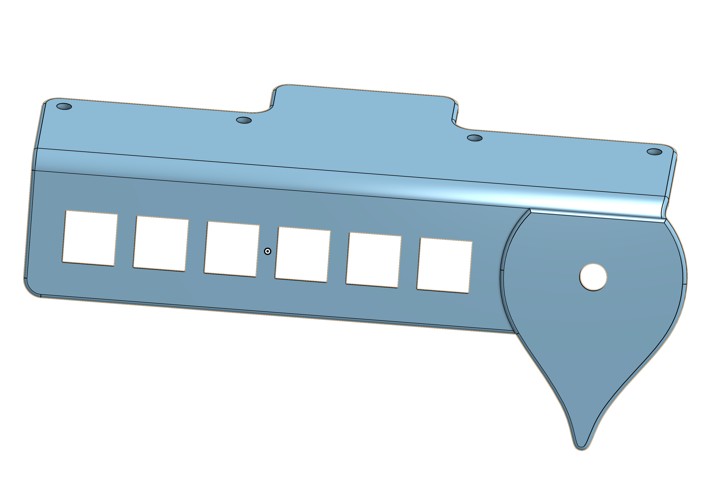

<div align="center">


</div>

---

# HC Macropad

PCB for HC Macropad event.

## BOM


- 1× EC11 rotary encoder
- 6× MX switches
- 6× SOD123 diodes
- (optional) 12× SK6812 Mini-E LEDs

## 3D Model



The 3D model was designed with [OnShape](https://onshape.com) and is available
[publicly](https://cad.onshape.com/documents/3070554cf94c5dc376b0a8a4/w/4d0968bd551d0635d2f8d7e6/e/86d2deca2d0d715bf15eadd2?renderMode=0&uiState=67038575d1a53e07c780a03b).

## Firmware

The firmware is powered by [QMK](https://qmk.fm) and can be found in
[0xcharly/qmk_firmware](https://github.com/0xcharly/qmk_firmware/tree/hc-macropad)
on the `hc-macropad` branch.

The keyboard and keymap are defined under `keyboards/hc_macropad` and can be
built using the QMK CLI:

```sh
qmk compile -kb hc_macropad -km default
```

See the
[README.md](https://github.com/0xcharly/qmk_firmware/blob/hc-macropad/keyboards/hc_macropad/readme.md)
for more information.

## First prototypes


## Credits

The PCB design, and specifically the RP2040-based controller is based off the
work of [Bastard Keyboards](https://bastardkb.com), adapted from their
[Dilemma](https://github.com/Bastardkb/Dilemma) design.
